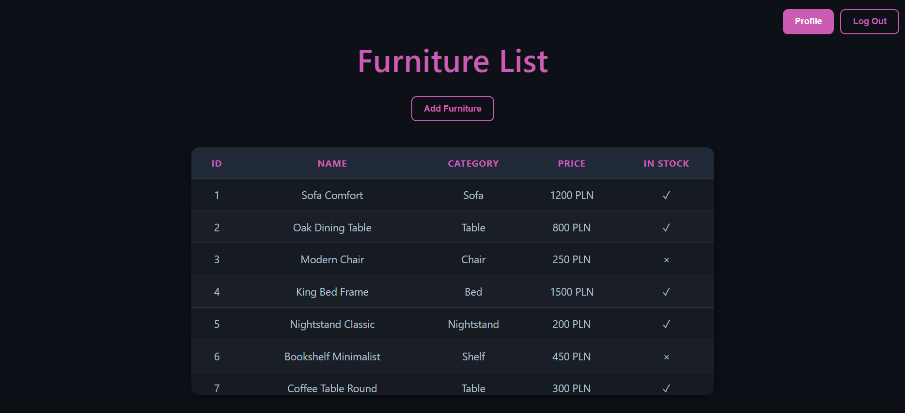
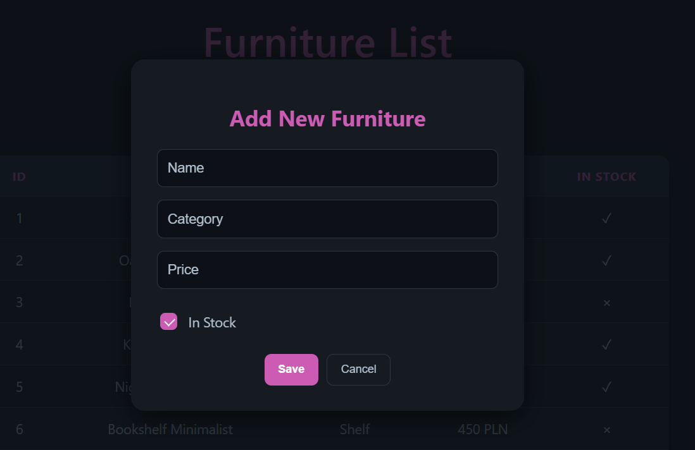
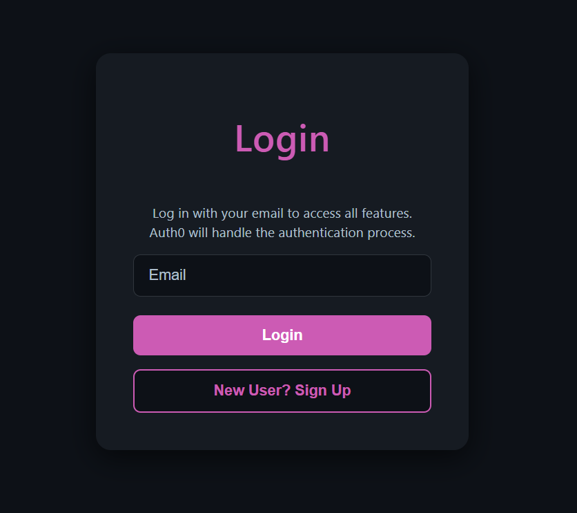

# Profile (Furniture) App

A full-stack web application for managing furniture items with role-based access control, built with React, Node.js, Express, Prisma, and SQLite. Authentication and authorization are handled using Auth0 and JWT tokens.

## Overview

This application consists of:

- **Backend**: Node.js with Express, using Prisma as the ORM and SQLite as the database. Includes mock data seeded via a `seed` script.
- **Frontend**: React application that interacts with the backend API.
- **Authentication & Authorization**: Auth0 handles login and JWT tokens. The app supports role-based access:

  - **User**: Can view furniture lists and their profile.
  - **Admin**: Can view, add, and delete furniture items. View their profile.

## Features

- Browse furniture items,
- Add new furniture items (admin only),
- Delete furniture items (admin only),
- View user profile,
- Log in or create a new account,
- JWT-based authentication and role integration via Auth0,
- Docker integration,
- CI/CD pipeline for backend.

## Installation & Setup with Docker

1. Navigate to the root folder and set variables in `docker-compose.yml` file:

```env
AUTH0_DOMAIN=YOUR_AUTH0_DOMAIN
AUTH0_AUDIENCE=YOUR_AUTH0_API_IDENTIFIER
```

2. Build both the backend and frontend images:

```bash
docker compose build
```

3. Start all services:

```bash
docker compose up
```

## Installation & Setup without Docker

### Backend Setup

1. Navigate to the backend folder and install dependencies:

```bash
npm install
```

2. Configure environment variables:

- Create a `.env` file with the following (or change the name of `profile-app-be/env-file-template.txt` file):

```env
AUTH0_DOMAIN=YOUR_AUTH0_DOMAIN
AUTH0_AUDIENCE=YOUR_AUTH0_API_IDENTIFIER
PORT=3000
```

3. Run Prisma migrations and seed the database:

```bash
npx prisma migrate dev --name init
npm run seed
```

4. Start the backend server:

```bash
npm start
```

The backend API will be available at `http://localhost:3000`.

### Frontend Setup

1. Navigate to the frontend folder and install dependencies:

```bash
npm install
```

2. Update Auth0 configuration

- in the `Auth0Provider` (in `profile-app/main.tsx`):

```ts
<Auth0Provider
  domain="YOUR_AUTH0_DOMAIN"
  clientId="YOUR_AUTH0_CLIENT_ID"
  authorizationParams={{
    redirect_uri: window.location.origin,
    audience: "YOUR_AUTH0_API_IDENTIFIER",
  }}
>
```

- and in the config file (in `profile-app/config.tsx`) change the `audience` parameter:

```ts
export const API = {
  audience: "YOUR_AUTH0_API_IDENTIFIER",
  roles: () => `${API.audience}/roles`,
};
```

3. Start the React + Vite app:

```bash
npm run dev
```

The frontend will be available at `http://localhost:5173/`.

## Usage

1. Open the frontend in a browser.
2. Log in or sign in via Auth0 (create sample accounts e.g.):

- Admin
  Email: `admin@admin.pl`
  Password: `Admin123!`

- User
  Email: `user@user.pl`
  Password: `User123!`

3. Explore the furniture list, add new items (admin only), or delete items (admin only). View user profile or log out.

## Tech Stack

- **Frontend**: React + Vite, TypeScript
- **Backend**: Node.js + Express, Prisma
- **Database**: SQLite
- **Authentication**: Auth0
- **Authorization**: Role-based (admin/user) with JWT

## Endpoints

| Method | Endpoint             | Role  | Description                 |
| ------ | -------------------- | ----- | --------------------------- |
| GET    | `/api/furniture`     | Any   | Get all furniture items     |
| GET    | `/api/furniture/:id` | Any   | Get furniture item by ID    |
| POST   | `/api/furniture`     | Admin | Add a new furniture item    |
| DELETE | `/api/furniture/:id` | Admin | Delete furniture item by ID |

## Testing

The backend API includes automated tests for all furniture endpoints using Jest and Supertest. Prisma and authentication middleware are fully mocked to isolate tests from the database and external services.

### Furniture API Tests

- **GET /api/furniture**

  - Returns a list of furniture items.
  - Returns an empty array if no furniture is present.

- **GET /api/furniture/:id**

  - Returns a furniture item by ID.
  - Returns 404 if the furniture item does not exist.

- **POST /api/furniture**

  - Returns 401 if the user is not authenticated.

- **DELETE /api/furniture/:id**
  - Returns 401 if the user is not authenticated.

### Running Tests

From the backend folder:

```bash
npm test
```

## Screenshots




