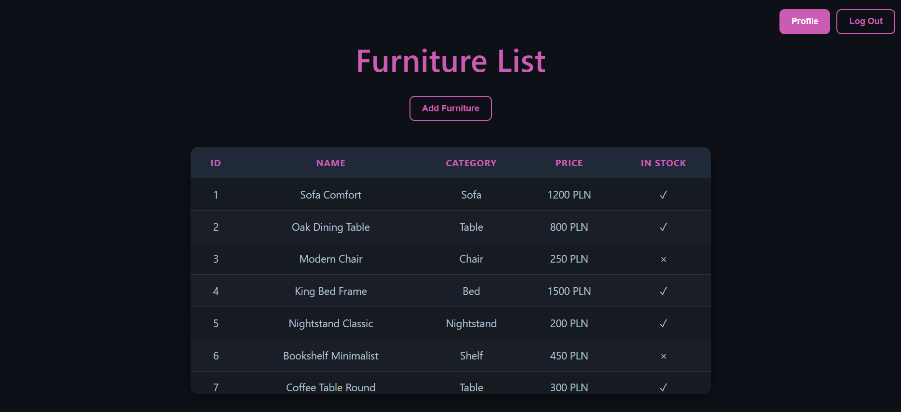
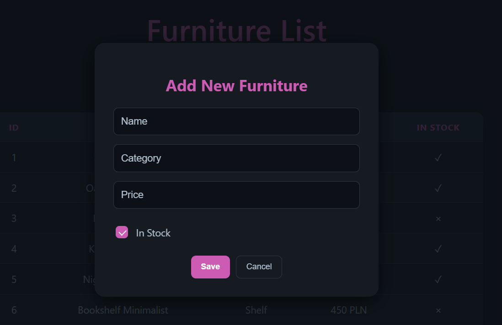
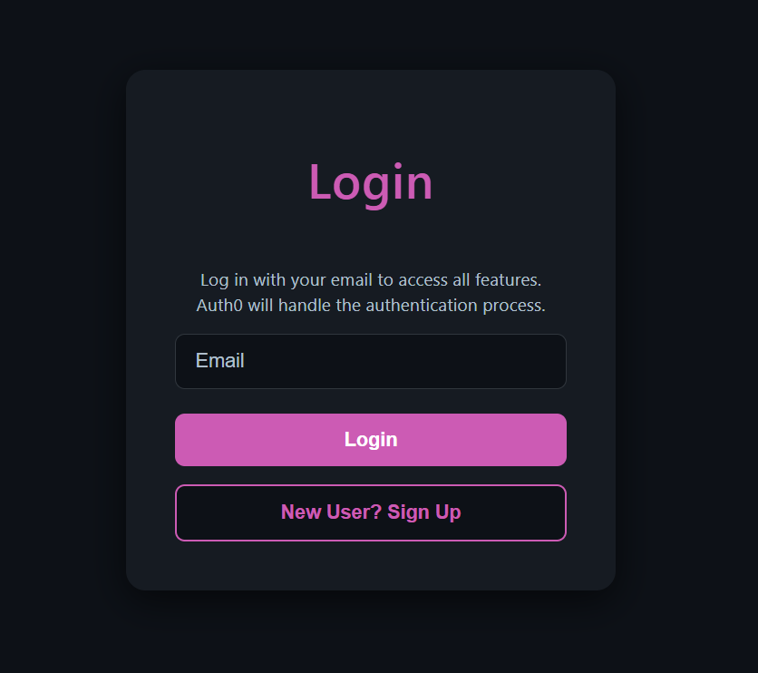

# Profile (Furniture) App

A full-stack web application for managing furniture items with role-based access control, built with React, Node.js, Express, Prisma, and SQLite. Authentication and authorization are handled using Auth0 and JWT tokens. The application is containerized with Docker for easy deployment, and includes automated tests.

## Table of Contents

- [Overview](#overview)
- [Features](#features)
- [Installation & Setup](#installation--setup)
  - [Auth0 Configuration](#auth0-configuration)
  - [Backend Setup](#backend-setup)
  - [Frontend Setup](#frontend-setup)
- [Running with Docker](#running-with-docker)
- [Usage](#usage)
- [Tech Stack](#tech-stack)
- [Endpoints](#endpoints)
- [Testing](#testing)
  - [API Tests](#api-tests)
  - [Error Handling](#error-handling)
  - [Running Tests](#running-tests)
- [Screenshots](#screenshots)

## Overview

This application consists of:

- **Backend**: Node.js with Express, using Prisma as the ORM and SQLite as the database. Includes mock data seeded via a `seed` script.
- **Frontend**: React application that interacts with the backend API.
- **Authentication & Authorization**: Auth0 handles login and JWT tokens. The app supports role-based access:

  - **User**: Can view furniture lists and their profile.
  - **Admin**: Can view, add, and delete furniture items. View their profile.

## Features

- Browse furniture items,
- Add new furniture items (admin only),
- Delete furniture items (admin only),
- View user profile,
- Log in or create a new account,
- JWT-based authentication and role integration via Auth0,
- Docker integration,
- CI/CD pipeline for backend,
- Mock data for testing.

## Installation & Setup

### Auth0 Configuration

1. Navigate to the frontend configuration file (`profile-app/config.tsx`) and replace the following values with your own Auth0 configuration:

   ```ts
   audience: "<YOUR_AUTH0_API_IDENTIFIER>",
   domain: "<YOUR_AUTH0_DOMAIN>",
   clientId: "<YOUR_AUTH0_CLIENT_ID>",
   ```

2. Navigate to the backend folder (`profile-app-be/`) and create a `.env` file with the following:

   ```env
   DATABASE_URL="file:./dev.db" # Database connection

   AUTH0_DOMAIN=YOUR_AUTH0_DOMAIN
   AUTH0_AUDIENCE=YOUR_AUTH0_API_IDENTIFIER
   PORT=3000
   ```

3. Create a Custom Post-Login Action in the Actions Library (e.g. `Add roles to access token`).

   - Paste the following code into the action to add user roles to the token:

   ```ts
   exports.onExecutePostLogin = async (event, api) => {
     const namespace = "YOUR_AUTH0_API_IDENTIFIER";

     if (event.authorization) {
       api.accessToken.setCustomClaim(
         `${namespace}/roles`,
         event.authorization.roles
       );
     }
   };
   ```

   - Attach the Action to the login trigger in the Auth0 dashboard.

_For development purposes, this repository includes temporary working Auth0 credentials, users with assigned roles, custom trigger action, `config.tsx` and `.env` files (rename `profile-app-be/env-file-template.txt`)
These are **only intended for local development** and may be removed at any time._

### Backend Setup

1. Navigate to the backend folder and install dependencies:

   ```bash
   npm install
   ```

2. Run Prisma migrations and seed the database:

   ```bash
   npx prisma migrate dev --name init
   npm run seed
   ```

3. Start the backend server:

   ```bash
   npm start
   ```

The backend API will be available at `http://localhost:3000`.

### Frontend Setup

1. Navigate to the frontend folder and install dependencies:

   ```bash
   npm install
   ```

2. Start the React + Vite app:

   ```bash
   npm run dev
   ```

The frontend will be available at `http://localhost:5173`.

## Running with Docker

1. Update the Auth0 configuration: [Auth0 Configuration](#auth0-configuration)

2. Build both the backend and frontend images from the root folder:

   ```bash
   docker compose build
   ```

3. Start all services:

   ```bash
   docker compose up
   ```

The app will be available at `http://localhost:5173` (API at `http://localhost:3000`).

## Usage

1. Open the frontend in a browser.
2. Log in via Auth0 or create an account, then create sample users and assign them roles (e.g., admin, user):

   - Admin -
     Email: `admin@admin.com`
     Password: `Admin123!`
     Role: `admin`

   - User -
     Email: `user@user.com`
     Password: `User123!`
     Role: `user`

3. Explore the furniture list, add new items (admin only), or delete items (admin only). View user profile or log out.

## Tech Stack

- **Frontend**: React + Vite, TypeScript
- **Backend**: Node.js + Express, Prisma
- **Database**: SQLite
- **Authentication**: Auth0
- **Authorization**: Role-based (admin/user) with JWT
- **Containerization**: Docker
- **CI/CD Pipeline**: GitHub Actions

## Endpoints

| Method | Endpoint             | Role  | Description                 |
| ------ | -------------------- | ----- | --------------------------- |
| GET    | `/api/furniture`     | Any   | Get all furniture items     |
| GET    | `/api/furniture/:id` | Any   | Get furniture item by ID    |
| POST   | `/api/furniture`     | Admin | Add a new furniture item    |
| DELETE | `/api/furniture/:id` | Admin | Delete furniture item by ID |

## Testing

The backend API includes automated tests for all furniture endpoints using Jest and Supertest. Prisma and authentication middleware are fully mocked to isolate tests from the database and external services.

### API Tests

- **GET /api/furniture**

  - Returns a list of furniture items.
  - Returns an empty array if no furniture is present.

- **GET /api/furniture/:id**

  - Returns a furniture item by ID.
  - Returns 404 if the furniture item does not exist.

- **POST /api/furniture**

  - Returns 401 if the user is not authenticated.

- **DELETE /api/furniture/:id**
  - Returns 401 if the user is not authenticated.

### Error Handling

- `401 Unauthorized`: User not logged in or invalid JWT
- `403 Forbidden`: User lacks permissions
- `404 Not Found`: Resource does not exist

### Running Tests

From the backend folder:

```bash
npm test
```

## Screenshots




